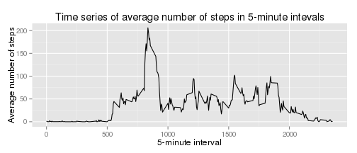
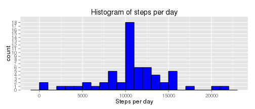
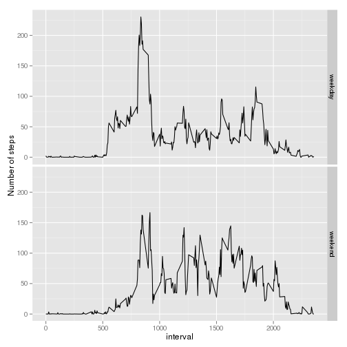

## Loading and preprocessing the data
Here we assume that the activity.zip file exists in the directory and unzip it if it has not been unzipped already.  
I will use the data.table package to prepare the data for easily computing statistics. Data.table is supposed to be more powerful than data.frame. I am concurrently taking also a few other courses and have subsequently redone analysis with dplyr as well - please bear with me with the different libraries!


```r
library(data.table)
if (!file.exists("activity.csv"))
  unzip("activity.zip")
activity <- read.csv("activity.csv") 
activity <- as.data.table(activity)
```

## Analysis of total number of steps taken per day

  
First, let's only take those rows with no missing values. Then, let's group the data by date: "per_day" data.table then contains the the sum of steps taken each day, ignoring the missing data.  

```r
library(dplyr)
activity.complete <- activity[complete.cases(activity)]
by_day <- group_by(activity.complete, date)   # using dplyr library here
per_day <- summarize(by_day, total_steps = sum(steps)) # and here
head(per_day)
```

```
##         date total_steps
## 1 2012-10-02         126
## 2 2012-10-03       11352
## 3 2012-10-04       12116
## 4 2012-10-05       13294
## 5 2012-10-06       15420
## 6 2012-10-07       11015
```

Let's take a look at the distribution of the number of steps each day: 


```r
library(ggplot2)
ggplot(per_day, aes(total_steps)) +
geom_bar(binwidth = 1000, fill = "blue", col="black") +
xlab("Steps per day") +
ggtitle("Histogram of steps per day") +
scale_y_discrete() 
```

 

  
Now let us compute some summary statistics on the 53 days in the dataset, namely the mean and median of the data in the histogram (using the dplyr package).


```r
summarise(per_day, "mean" = mean(total_steps), "median" = median(total_steps))
```

```
## Source: local data table [1 x 2]
## 
##       mean median
## 1 10766.19  10765
```
## The average daily activity pattern
In this subsection, we plot the average number of steps in 5 minute intervals. There are 288 5-minute intevals in a day. For each interval, we will average the number of steps taken at that time of day, over the days of the dataset. 


```r
activity.complete = tbl_df(activity.complete)
by_interval <- group_by(activity.complete, interval)
per_interval <- summarize(by_interval, "average_steps" = mean(steps))
ggplot(data = per_interval, aes(x = interval, y = average_steps)) + 
  geom_line()+
  ggtitle("Time series of average number of steps in 5-minute intevals")+
  xlab("5-minute interval")+
  ylab("Average number of steps")
```

 

For example, we see that for the first 8 hours of the day, there is virtually no steps. When does the maximum amount of average steps over 5-minutes occur? 

```r
filter(per_interval, average_steps == max(average_steps))
```

```
## Source: local data frame [1 x 2]
## 
##   interval average_steps
## 1      835      206.1698
```
This maximum is at around 2pm and is 206 steps. 

## Imputing missing values
The steps may be missing for part of the day or the whole day. The only column with missing values is the "steps" column. Total number of rows with missing values in the steps column: 

```r
missing <- is.na(activity$steps)
sum(missing)
```

```
## [1] 2304
```

```r
# another, dplyr way:  activity %>% filter(is.na(steps)) %>% summarise(n())
```
After seeing the variability of the average number of steps in the 5-minute intervals, I think it is most reasonable to replace missing values with the corresponding average for that particular interval. It wouldn't make sense to replace a missing value at an interval at say, 3am (when there would be 0 steps), with the average number for the day (definitely not close to 0). 


```r
activity <- as.data.frame(activity)  # otherwise merge gives me error
activity <- merge(activity, per_interval, by = "interval")  # eff. adds a column to activity
head(activity)
```

```
##   interval steps       date average_steps
## 1        0    NA 2012-10-01      1.716981
## 2        0     0 2012-11-23      1.716981
## 3        0     0 2012-10-28      1.716981
## 4        0     0 2012-11-06      1.716981
## 5        0     0 2012-11-24      1.716981
## 6        0     0 2012-11-15      1.716981
```

```r
activity <- activity %>%
  mutate(steps = ifelse(is.na(steps), average_steps, steps)) %>% #replacing missing with average
  select(-average_steps)     # removing the extra column
```
After imputing the missing values, we repeat the same analysis as before: 

```r
by_day <- group_by(activity, date)   
per_day <- summarize(by_day, total_steps = sum(steps))
summarise(per_day, "mean" = mean(total_steps), "median" = median(total_steps))
```

```
## Source: local data frame [1 x 2]
## 
##       mean   median
## 1 10766.19 10766.19
```

```r
ggplot(per_day, aes(total_steps)) +
geom_bar(binwidth = 1000, fill = "blue", col="black") +
xlab("Steps per day") +
ggtitle("Histogram of steps per day") +
scale_y_discrete() 
```

 

As we see, the effect of imputing missing data is adding 8 to the mode. This is because the missing data all happened on 8 days where all the data was missing (from all the intervals), and so the number of steps was the same (and was equal to the sum of average number of steps over the interval). 

## Differences in activity patterns between weekdays and weekends
First we add a column "day" to activity with "weekend" or "weekday"; then we group by both daytype and interval and summarise():

```r
activity <- activity %>%
    mutate(daytype = ifelse(weekdays(as.POSIXlt(date)) %in% c("Sunday", "Saturday"), 
        "weekend", "weekday") ) %>%
    mutate(daytype = as.factor(daytype))
by_daytype_interval = group_by(activity, daytype, interval)
newactivity = summarise(by_daytype_interval, avg_steps = mean(steps))
head(newactivity)
```

```
## Source: local data frame [6 x 3]
## Groups: daytype
## 
##   daytype interval  avg_steps
## 1 weekday        0 2.25115304
## 2 weekday        5 0.44528302
## 3 weekday       10 0.17316562
## 4 weekday       15 0.19790356
## 5 weekday       20 0.09895178
## 6 weekday       25 1.59035639
```


```r
ggplot(newactivity, aes(interval, avg_steps)) + 
  geom_line() + 
  facet_grid(daytype ~ .) + 
  ylab("Number of steps")
```

 

We can see that on weekends people sleep in longer, and are more active for most of the day, except around lunchtime. 
